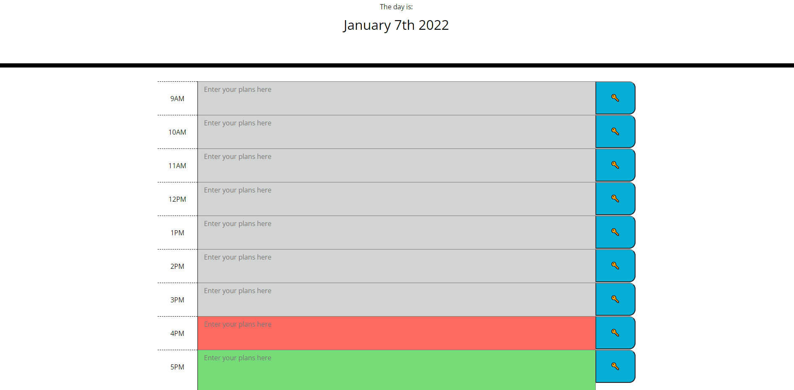

# Work-Day-Scheduler
This is a Javascript based day planner

## Instructions for use

- The day will be displayed along the top of the screen.
- Enter your plans for the day by typing in the given hour blocks.
- Each hour block will have a corresponding color depending on which hour it is in the day.
- When the current time is after an hour block, that block will be grey.
- When the current time is the hour, that block will be red.
- When the current time is before an hour block, that block will be green.
- Clicking on the 🔑 icon will save that task upon page reload.

## Langauge used:
- HTML
- CSS
- Javascript

## Assets used:
- Bootstrap
- JQuery
- MomentJS

## Demo 

## License:

No license.

## Links:

-Link to my [GitHub](https://github.com/idpetersen)

-Link to deployed page https://idpetersen.github.io/Work-Day-Scheduler/

